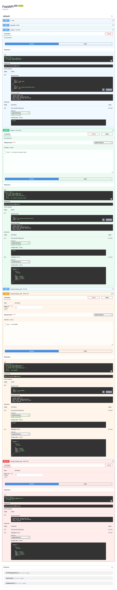

# Task API

A small CRUD API for managing a to-do list, built with FastAPI. Supports creating, reading, updating, and deleting tasks, backed by an in-memory list (no database; data resets on restart).

## How to run

```
py -m pip install fastapi uvicorn
py -m uvicorn main:app --reload
```

Server runs at `http://localhost:8000`. Interactive docs available at `http://localhost:8000/docs`.

## Endpoints

| Method | Path           | Description                    |
|--------|----------------|---------------------------------|
| GET    | `/`            | API info                        |
| GET    | `/health`      | Health check                    |
| GET    | `/tasks`       | List all tasks                  |
| GET    | `/tasks/{id}`  | Get a single task               |
| POST   | `/tasks`       | Create a new task               |
| PUT    | `/tasks/{id}`  | Update a task                   |
| DELETE | `/tasks/{id}`  | Delete a task                   |

## Example request

```
curl.exe -i "http://localhost:8000/tasks/1"

HTTP/1.1 200 OK
date: Sun, 19 Jul 2026 22:02:21 GMT
server: uvicorn
content-length: 40
content-type: application/json

{"id":1,"title":"Buy milk","done":false}
```

## Swagger UI

Full CRUD cycle tested via `/docs` "Try it out":



## Notes

- Data is in-memory only; restarting the server resets tasks back to the 3 seed examples.
- Validation errors (missing/empty `title`) return `400` with a JSON error body.