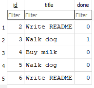

# Task API

A CRUD API for managing a to-do list, built with FastAPI and SQLite. Supports creating, reading, updating, and deleting tasks. **Data persists across server restarts.**

## Why SQLite?

SQLite is a lightweight, serverless database stored in a single file. No installation or setup required — it creates itself on first run. Tasks survive server restarts because they're saved to disk, not kept in memory.

## How to run

```bash
py main.py
```

Server runs at `http://localhost:8000`. The database file `tasks.db` is created automatically in your project folder.

## Database

- **File:** `tasks.db` (created automatically on first run)
- **Table:** `tasks` with columns `id` (primary key), `title` (text), `done` (boolean)
- **Seed:** 3 example tasks inserted only on first run

## Endpoints

| Method | Path           | Description      |
|--------|----------------|------------------|
| GET    | `/tasks`       | List all tasks   |
| GET    | `/tasks/{id}`  | Get one task     |
| POST   | `/tasks`       | Create a task    |
| PUT    | `/tasks/{id}`  | Update a task    |
| DELETE | `/tasks/{id}`  | Delete a task    |

## Example SQL query

```sql
SELECT COUNT(*) FROM tasks;
```

**Result:** Returns the count of all tasks in the database.

## Screenshot



## Notes

- Tasks are stored in `tasks.db` (SQLite file) and survive restarts
- Validation: missing/empty `title` returns `400`
- Unknown task ids return `404`